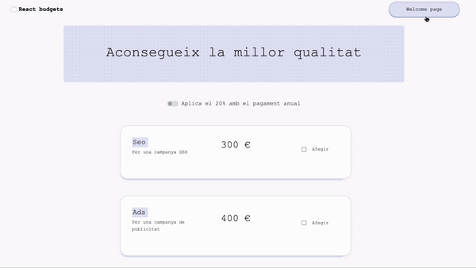

# React-Budgets

<div align="center"></div>

## Description

This project is a web application designed to streamline the calculation of website budgets. By using checkboxes, input fields, and buttons, our application enhances user interaction, adjusting the total price based on the selected options.

## Table of Contents

1. [Description](#description)
2. [Key Features](#key-features)
3. [Technologies Used](#technologies-used)
4. [Project Structure](#project-structure)
5. [Project Setup](#project-setup)
   - [Prerequisites](#prerequisites)
   - [Installation](#installation)
6. [Usage Instructions](#usage-instructions)
7. [Contribution Guidelines](#contribution-guidelines)
8. [Authors](#authors)

## Key Features

- **Show price based on checked checkboxes**: Users can select services they need, and the total price will update in real-time based on their selections.
- **Total price based on selected pages and languages**: Users can specify the number of pages and languages for the website, and the application will calculate the additional cost.
- **Add and subtract pages and languages buttons**: Easy-to-use buttons for adjusting the number of pages and languages.
- **Welcome page**: An introductory page explaining the purpose and functionality of the application.
- **Budget list**: Users can save and view multiple budgets.
- **Pop-ups**: Help and information pop-ups for user guidance.
- **Filter options**: Sorting and searching options for easier management of multiple budgets.
- **20% discount option with annual contracting**: Users can apply a discount for annual contracts.

## Technologies Used

     


### Project Structure

```
REACT-ONBOARDING-DIGITAL/
├── node_modules/        # (Generated upon installation)
├── public/
├── src/
│   ├── assets/
│   ├── components/
│   │   ├── BudgetInProgress/
│   │   |     ├── BudgetInProgress.css
│   │   |     └── BudgetInProgress.jsx
│   │   ├──  Card/
│   │   |     ├── Card.css
│   │   |     └── Card.jsx
│   │   ├── Form/
│   │   |     ├── Form.css
│   │   |     └── Form.jsx
│   │   ├──  PurchaseOptions/
│   │   |     ├── PurchaseOptions.css
│   │   |     └── PurchaseOptions.jsx
│   │   └── TotalPrice/
│   │   |     ├── TotalPrice.css
│   │   |     └── TotalPrice.jsx
│   ├── context/
│   │   ├── BudgrtContext.jsx
│   │   ├── PriceContext.jsx
│   │   ├── ServiceListContext.jsx
│   │   ├── ServiceListProvider.jsx
│   │   └── UpdateServiceLIstContext.jsx
│   ├── data/
│   |   └── budgetData.json
│   ├── hooks/
│   |   ├── UseServiceList.jsx
│   |   └── UpdateServiceListContext.jsx
│   ├── pages/
│   │   ├── Home/
│   │   |     ├── BudgetHome.css
│   │   |     └── BudgetHome.jsx
│   │   └──   Welcome/
│   │   |     ├── BudgetWelcome.css
│   │   |     └── BudgetWelcome.jsx
│   ├── App.jsx
│   ├── main.css
│   └── main.jsx
├── .eslintrc.cjs
├── .gitignore
├── index.html
├── package-lock.json
├── package.json
├── README.md
└── vite.config.js
```

## Project Setup

### Prerequisites

- Node.js
- npm (Node Package Manager)

### Installation

1. Clone the repository:

   ```bash
   git clone https://github.com/Luovtyrell/React-budgets.git
   cd React-budgets
   ```

2. Install dependencies:

   ```bash
   npm install
   ```

3. Start the development server:

   ```bash
   npm run dev
   ```

## Usage Instructions

1. Navigate to the welcome page to understand the purpose and functionality of the application.
2. Use the checkboxes to select the services you need.
3. Adjust the number of pages and languages using the provided input fields and buttons.
4. View the total price update in real-time based on your selections.
5. Save and manage multiple budgets in the budget list.
6. Apply a 20% discount for annual contracts if needed.

## Contribution Guidelines

If you wish to contribute to this project, please follow these steps:

1. Fork the repository.
2. Create a new branch: `git checkout -b feature-branch-name`
3. Make your changes and commit them: `git commit -m 'Add some feature'`
4. Push to the branch: `git push origin feature-branch-name`
5. Submit a pull request.
6. 

## Authors

<div align="center">

| [](https://github.com/abicelaya) <br>[@abicelaya](https://github.com/abicelaya) | [](https://www.linkedin.com/in/luovtyrell/) <br>[@Luovtyrell](https://www.github.com/Luovtyrell) |
|:---:|:---:|

</div>
